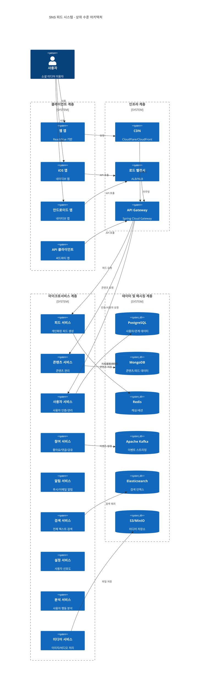
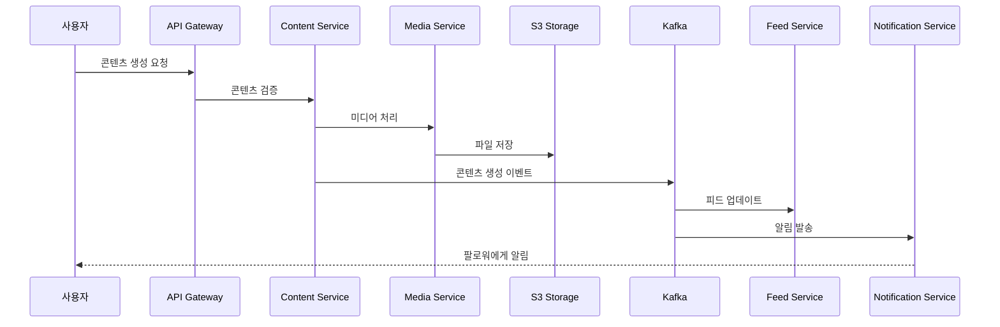
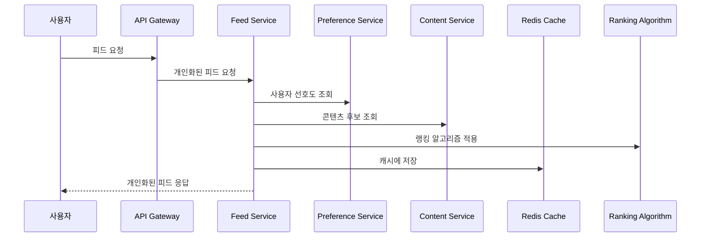
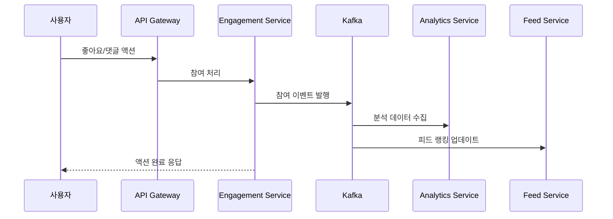
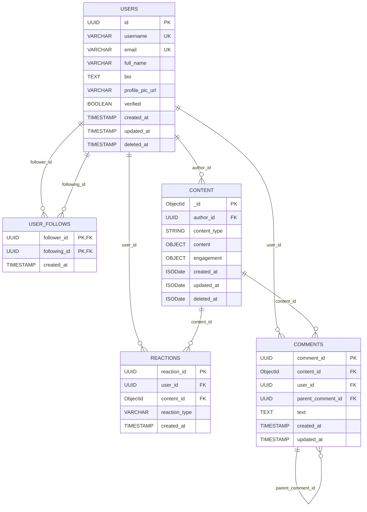
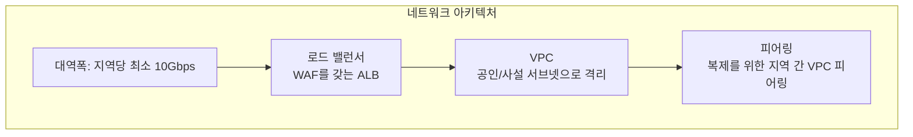
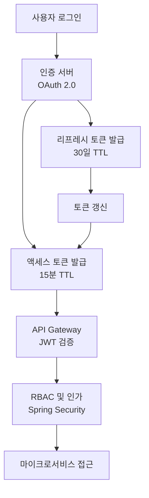

# SNS 피드 시스템 - 아키텍처 문서

## 개요

본 문서는 확장 가능한 소셜 네트워킹 콘텐츠 전달 플랫폼인 SNS 피드 시스템의 포괄적인 시스템 아키텍처를 설명합니다. 이 아키텍처는 명확한 관심사 분리를 통한 마이크로서비스 원칙을 따르며, 수백만 사용자의 실시간 콘텐츠 업데이트와 개인화된 피드 생성을 처리하도록 설계되었습니다.

## 목차

1. [시스템 개요](#시스템-개요)
2. [상위 수준 아키텍처](#상위-수준-아키텍처)
3. [핵심 컴포넌트](#핵심-컴포넌트)
4. [데이터 흐름](#데이터-흐름)
5. [기술 스택](#기술-스택)
6. [데이터 모델](#데이터-모델)
7. [확장성 아키텍처](#확장성-아키텍처)
8. [인프라 요구사항](#인프라-요구사항)
9. [보안 아키텍처](#보안-아키텍처)
10. [API 설계](#api-설계)
11. [배포 아키텍처](#배포-아키텍처)
12. [모니터링 및 관찰성](#모니터링-및-관찰성)
13. [재해 복구](#재해-복구)
14. [구현 로드맵](#구현-로드맵)

## 시스템 개요

### 아키텍처 원칙

- **마이크로서비스 아키텍처**: 독립적이고 느슨하게 결합된 서비스
- **이벤트 중심 통신**: 분리를 위한 비동기 메시지 전달
- **수평적 확장성**: 분산 배포를 위해 설계된 서비스
- **고가용성**: 단일 장애점 없음
- **데이터 지역성**: 전략적 캐싱 및 데이터 분산
- **보안 우선 설계**: 심층 방어 접근법

### 비기능적 요구사항

- **성능**: 피드 조회 API 응답 시간 < 200ms
- **가용성**: 99.9% 가동 시간 SLA
- **확장성**: 일일 활성 사용자 천만 명 이상 지원
- **처리량**: 초당 10만+ 요청 처리
- **데이터 일관성**: 피드 업데이트 최종 일관성
- **보안**: OWASP 준수, 개인정보 보호

## 상위 수준 아키텍처



## 핵심 컴포넌트

### 1. 피드 서비스 (Feed Service)
**책임**: 사용자에게 개인화된 피드 생성 및 제공
- 피드 랭킹 및 개인화
- 피드 캐싱 및 최적화
- 페이지네이션 및 무한 스크롤 지원
- WebSocket을 통한 실시간 피드 업데이트

**기술**: Spring Boot (Kotlin), gRPC, WebSocket

### 2. 콘텐츠 서비스 (Content Service)
**책임**: 모든 콘텐츠 생명주기 작업 관리
- 콘텐츠 생성 및 검증
- 콘텐츠 저장 및 조회
- 미디어 첨부 파일 처리
- 콘텐츠 조정

**기술**: Spring Boot (Kotlin), JOOQ, MongoDB

### 3. 사용자 서비스 (User Service)
**책임**: 사용자 관리 및 인증
- 사용자 등록 및 프로필 관리
- 인증 및 권한 부여
- 소셜 그래프 관리 (팔로우, 차단)
- 사용자 세션 관리

**기술**: Spring Boot (Kotlin), MySQL, Redis

### 4. 참여 서비스 (Engagement Service)
**책임**: 사용자 상호작용 추적 및 처리
- 좋아요, 댓글, 공유 작업
- 참여 메트릭 집계
- 상호작용 이벤트 스트리밍
- 참여 기반 추천

**기술**: Spring Boot (Kotlin), Kafka, Redis

### 5. 알림 서비스 (Notification Service)
**책임**: 모든 알림 전달 처리
- 푸시 알림
- 이메일 알림
- 인앱 알림
- 알림 설정

**기술**: Spring Boot (Kotlin), Firebase, SendGrid

### 6. 검색 서비스 (Search Service)
**책임**: 콘텐츠 및 사용자 검색 기능
- 전체 텍스트 검색
- 해시태그 검색
- 사용자 검색
- 검색 제안

**기술**: Elasticsearch, Spring Boot (Kotlin)

### 7. 설정 서비스 (Preference Service)
**책임**: 사용자 설정 및 선호도 관리
- 콘텐츠 선호도
- 개인정보 설정
- 알림 설정
- 알고리즘 설정

**기술**: Spring Boot (Kotlin), MySQL, Redis

### 8. 분석 서비스 (Analytics Service)
**책임**: 분석 데이터 수집 및 처리
- 사용자 행동 추적
- 콘텐츠 성과 메트릭
- 시스템 성능 메트릭
- A/B 테스트 프레임워크

**기술**: Spring Boot (Kotlin), ClickHouse, Kafka

### 9. 미디어 서비스 (Media Service)
**책임**: 미디어 처리 및 전달
- 이미지 처리 및 최적화
- 비디오 트랜스코딩
- CDN 통합
- 미디어 메타데이터 추출

**기술**: Spring Boot (Kotlin), FFmpeg, S3

## 데이터 흐름

### 콘텐츠 생성 흐름


### 피드 생성 흐름


### 참여 흐름


## 기술 스택

### 백엔드 서비스
- **언어**: Kotlin 1.9.25
- **프레임워크**: Spring Boot 3.5.4
- **빌드 도구**: Gradle
- **JVM**: Java 21

### 데이터베이스
- **MySQL 8.0**: 사용자 데이터, 관계형 데이터, 구조화된 데이터
- **MongoDB 7.0**: 콘텐츠 저장, 피드 데이터, 유연한 스키마
- **Redis 7.2**: 캐싱, 세션 관리, 실시간 데이터
- **Elasticsearch 8.11**: 검색 기능, 콘텐츠 인덱싱

### 메시징 및 스트리밍
- **Apache Kafka 3.6**: 이벤트 스트리밍, 비동기 통신
- **WebSocket**: 실시간 업데이트
- **gRPC**: 서비스 간 통신

### 인프라
- **컨테이너**: Docker
- **오케스트레이션**: Kubernetes
- **서비스 메시**: Istio
- **CI/CD**: GitHub Actions / GitLab CI

### 모니터링 및 관측성
- **메트릭**: Prometheus + Grafana
- **로깅**: ELK Stack (Elasticsearch, Logstash, Kibana)
- **트레이싱**: Jaeger
- **APM**: New Relic / DataDog

### 클라우드 서비스
- **제공업체**: AWS / GCP / Azure (멀티클라우드 지원)
- **CDN**: CloudFlare / AWS CloudFront
- **스토리지**: S3 / Google Cloud Storage
- **컨테이너 레지스트리**: ECR / GCR

## 데이터 모델

### 데이터베이스 설계 개요


### 사용자 모델 (MySQL)
```sql
CREATE TABLE users (
    id CHAR(36) PRIMARY KEY,
    username VARCHAR(50) UNIQUE NOT NULL,
    email VARCHAR(255) UNIQUE NOT NULL,
    full_name VARCHAR(255),
    bio TEXT,
    profile_pic_url VARCHAR(500),
    verified BOOLEAN DEFAULT FALSE,
    created_at TIMESTAMP NOT NULL DEFAULT CURRENT_TIMESTAMP,
    updated_at TIMESTAMP NOT NULL DEFAULT CURRENT_TIMESTAMP ON UPDATE CURRENT_TIMESTAMP,
    deleted_at TIMESTAMP NULL
);

CREATE TABLE user_follows (
    follower_id CHAR(36) NOT NULL,
    following_id CHAR(36) NOT NULL,
    created_at TIMESTAMP NOT NULL DEFAULT CURRENT_TIMESTAMP,
    PRIMARY KEY (follower_id, following_id),
    FOREIGN KEY (follower_id) REFERENCES users(id),
    FOREIGN KEY (following_id) REFERENCES users(id)
);
```

### 콘텐츠 모델 (MongoDB)
```javascript
{
  "_id": ObjectId,
  "author_id": UUID,
  "content_type": "text|image|video|link",
  "content": {
    "text": String,
    "media_urls": [String],
    "hashtags": [String],
    "mentions": [UUID]
  },
  "engagement": {
    "likes_count": Number,
    "comments_count": Number,
    "shares_count": Number,
    "views_count": Number
  },
  "created_at": ISODate,
  "updated_at": ISODate,
  "deleted_at": ISODate
}
```

### 피드 캐시 모델 (Redis)
```
Key: feed:user:{user_id}:page:{page_num}
Value: JSON array of post IDs with scores
TTL: 300 seconds (5분)

Key: feed:metadata:{user_id}
Value: {
  "last_refresh": timestamp,
  "total_items": number,
  "algorithm_version": string
}
```

## 확장성 아키텍처

### 수평적 확장 전략

```mermaid
graph TB
    subgraph "서비스 확장"
        A["자동 확장<br/>CPU/Memory/Latency 기반"]
        B["최소 인스턴스: 3개<br/>HA 보장"]
        C["최대 인스턴스<br/>10-100개 (서비스별)"]
        D["트리거 조건<br/>CPU>70%, Memory>80%<br/>Latency p95>500ms"]
    end
    
    subgraph "데이터베이스 확장"
        E["MySQL<br/>Read Replicas + Connection Pooling"]
        F["MongoDB<br/>Sharded Cluster + Replica Sets"]
        G["Redis<br/>Cluster Mode (6+ Shards)"]
        H["Elasticsearch<br/>3 Master + 5+ Data Nodes"]
    end
    
    subgraph "캐싱 전략"
        I["L1 Cache<br/>애플리케이션 레벨 (Caffeine)"]
        J["L2 Cache<br/>Redis 분산 캐시"]
        K["L3 Cache<br/>CDN 엣지 캐싱"]
    end
    
    A --> B --> C --> D
    E --> F --> G --> H
    I --> J --> K
```



#### 서비스 확장
- **자동 확장**: CPU, 메모리, 요청 지연 시간 기반
- **최소 인스턴스**: HA를 위한 서비스당 3개
- **최대 인스턴스**: 서비스에 따라 가변 (10-100개)
- **확장 트리거**:
  - CPU > 70% for 2분
  - Memory > 80% for 2분
  - Request latency p95 > 500ms

#### 데이터베이스 확장
- **MySQL**: 연결 풀링을 통한 읽기 레플리카, Master-Slave 구성
- **MongoDB**: 레플리카 세트를 갖는 샤드 클러스터
- **Redis**: 최소 6개 샤드로 클러스터 모드
- **Elasticsearch**: 3개 마스터 노드, 5개 이상 데이터 노드

### 캐싱 전략
1. **L1 캐시**: 애플리케이션 수준 (Caffeine)
2. **L2 캐시**: Redis 분산 캐시
3. **L3 캐시**: CDN 엣지 캐싱

### 로드 분산
- **지리적 분산**: 멀티 리전 배포
- **트래픽 라우팅**: GeoDNS 및 지역별 로드 밸런서
- **데이터 복제**: 중요 데이터의 지역 간 복제

## 인프라 요구사항

### 컴퓨팅 리소스

#### 프로덕션 환경
```yaml
Feed Service (피드 서비스):
  instances: 10-50 (자동 확장)
  cpu: 4 코어
  memory: 8GB
  storage: 20GB SSD

Content Service (콘텐츠 서비스):
  instances: 10-30 (자동 확장)
  cpu: 4 코어
  memory: 8GB
  storage: 50GB SSD

User Service (사용자 서비스):
  instances: 5-20 (자동 확장)
  cpu: 2 코어
  memory: 4GB
  storage: 20GB SSD

Engagement Service (참여 서비스):
  instances: 5-25 (자동 확장)
  cpu: 2 코어
  memory: 4GB
  storage: 20GB SSD
```

### 스토리지 요구사항
- **MySQL**: 1TB (자동 증설), NVMe SSD
- **MongoDB**: 초기 5TB, 노드 간 샤드 분산
- **Redis**: 클러스터당 100GB RAM
- **S3/오브젝트 스토리지**: 초기 50TB 용량
- **Elasticsearch**: 클러스터 전체 2TB

### 네트워크 요구사항


- **대역폭**: 지역당 최소 10Gbps
- **로드 밸런서**: WAF를 갖는 Application Load Balancer
- **VPC**: 공인/사설 서브넷으로 격리된 네트워크
- **피어링**: 복제를 위한 지역 간 VPC 피어링

## 보안 아키텍처

### 인증 및 인가


- **인증**: OAuth 2.0 + JWT 토큰
- **인가**: Spring Security를 통한 RBAC
- **토큰 관리**: 
  - 액세스 토큰: 15분 TTL
  - 리프레시 토큰: 30일 TTL
  - 갱신 시 토큰 로테이션

### 데이터 보호
```yaml
저장된 데이터 암호화:
  - 데이터베이스: AES-256 암호화
  - 오브젝트 스토리지: SSE-S3 또는 고객 관리 키
  - 백업: 별도 키로 암호화

전송 데이터 암호화:
  - 외부: TLS 1.3 최소
  - 내부: 서비스 간 mTLS
  - gRPC: 인증서 검증을 통한 TLS
```

### API 보안
- **요청 제한**: 
  - 인증된 사용자: 사용자당 분당 1000개 요청
  - 비인증 사용자: IP당 분당 100개 요청
- **DDoS 보호**: CloudFlare/AWS Shield
- **WAF 규칙**: OWASP Top 10 보호
- **API 키**: 90일마다 로테이션

### 규정 준수 및 프라이버시
- **GDPR 준수**: 
  - 삭제 권리
  - 데이터 이동 기능
  - 동의 관리
- **데이터 보존**: 
  - 활성 콘텐츠: 무제한
  - 삭제된 콘텐츠: 30일 연삭제
  - 로그: 90일
- **개인정보 처리**: 
  - 민감 데이터 토큰화
  - 접근 감사 로그
  - 비프로덕션 데이터 마스킹

### 보안 모니터링
```yaml
SIEM 통합:
  - 인증 실패 시도
  - 권한 상승 시도
  - 비정상 API 패턴
  - 데이터 유출 탐지

취약점 관리:
  - 주간 종속성 스캔
  - 월간 침투 테스트
  - 분기별 보안 감사
  - CVE 모니터링 및 패치
```

## API 설계

### RESTful 엔드포인트

#### 피드 API
```
GET /api/v1/feed
  쿼리 매개변수:
    - page: integer (기본값: 1)
    - size: integer (기본값: 20, 최대: 50)
    - filter: string (선택사항)
  응답: 200 OK
    {
      "items": [...],
      "page": 1,
      "total": 1000,
      "has_more": true
    }

GET /api/v1/feed/refresh
  헤더:
    - X-Last-Seen-Id: string
  응답: 200 OK
    {
      "new_items": [...],
      "count": 5
    }
```

#### 콘텐츠 API
```
POST /api/v1/content
  본문:
    {
      "type": "text|image|video",
      "text": "string",
      "media_ids": ["uuid"],
      "visibility": "public|followers|private"
    }
  응답: 201 Created

GET /api/v1/content/{id}
  응답: 200 OK

DELETE /api/v1/content/{id}
  응답: 204 No Content
```

#### 참여 API
```
POST /api/v1/content/{id}/like
  응답: 200 OK

DELETE /api/v1/content/{id}/like
  응답: 204 No Content

POST /api/v1/content/{id}/comment
  본문: { "text": "string" }
  응답: 201 Created
```

### WebSocket 이벤트
```javascript
// 연결
ws://api.example.com/ws/feed

// 피드 업데이트 구독
{
  "type": "subscribe",
  "channel": "feed_updates"
}

// 새 콘텐츠 수신
{
  "type": "new_content",
  "data": {
    "content_id": "uuid",
    "preview": {...}
  }
}
```

### gRPC 서비스
```protobuf
service FeedService {
  rpc GetPersonalizedFeed(FeedRequest) returns (FeedResponse);
  rpc RefreshFeed(RefreshRequest) returns (RefreshResponse);
}

service ContentService {
  rpc CreateContent(CreateContentRequest) returns (Content);
  rpc GetContent(GetContentRequest) returns (Content);
  rpc DeleteContent(DeleteContentRequest) returns (Empty);
}
```

## 배포 아키텍처

### 환경 전략
```yaml
환경:
  개발(Development):
    - 단일 리전
    - 최소 중복성
    - 공유 데이터베이스
    
  스테이징(Staging):
    - 프로덕션 유사 설정
    - 단일 리전
    - 전체 서비스 스택
    
  프로덕션(Production):
    - 멀티 리전 (US-East, US-West, EU-West)
    - 완전 중복성
    - 격리된 리소스
```

### Kubernetes 구성
```yaml
apiVersion: apps/v1
kind: Deployment
metadata:
  name: feed-service
spec:
  replicas: 10
  strategy:
    type: RollingUpdate
    rollingUpdate:
      maxSurge: 2
      maxUnavailable: 1
  template:
    spec:
      containers:
      - name: feed-service
        image: feed-service:1.0.0
        resources:
          requests:
            memory: "4Gi"
            cpu: "2"
          limits:
            memory: "8Gi"
            cpu: "4"
        livenessProbe:
          httpGet:
            path: /health
            port: 8080
          initialDelaySeconds: 30
          periodSeconds: 10
        readinessProbe:
          httpGet:
            path: /ready
            port: 8080
          initialDelaySeconds: 5
          periodSeconds: 5
```

### CI/CD 파이프라인
```yaml
파이프라인 단계:
  1. 코드 커밋:
     - 린팅
     - 단위 테스트
     - 보안 스캔
     
  2. 빌드:
     - Docker 이미지 생성
     - 취약점 스캔
     - 레지스트리로 푸시
     
  3. 테스트:
     - 통합 테스트
     - 성능 테스트
     - 계약 테스트
     
  4. 스테이징 배포:
     - Kubernetes 배포
     - 스모크 테스트
     - 성능 검증
     
  5. 프로덕션 배포:
     - Blue-green 배포
     - 카나리 릴리스 (5% → 25% → 50% → 100%)
     - 롤백 기능
```

## 모니터링 및 관찰성

### 주요 메트릭

#### 시스템 메트릭
- **API 지연 시간**: p50, p95, p99
- **오류율**: 4xx, 5xx 응답
- **처리량**: 초당 요청 수
- **가용성**: 가동 시간 백분율

#### 비즈니스 메트릭
- **피드 로드 시간**: 처음 바이트까지 시간
- **참여율**: 좋아요/조회수 비율
- **콘텐츠 생성**: 분당 게시물 수
- **활성 사용자**: DAU, MAU

### 알림 규칙
```yaml
중요 알림:
  - API 오류율 > 1% (5분간 지속)
  - API 지연시간 p95 > 1초 (5분간 지속)
  - 데이터베이스 연결 풀 고갈
  - Kafka 지연 > 10000 메시지
  
경고 알림:
  - CPU 사용률 > 80% (10분간 지속)
  - 메모리 사용률 > 85% (10분간 지속)
  - 디스크 사용률 > 80%
  - 캐시 적중률 < 80%
```

### 로깅 전략
```yaml
로그 레벨:
  - ERROR: 시스템 오류, 실패한 작업
  - WARN: 성능 저하, 재시도 작업
  - INFO: 요청/응답, 비즈니스 이벤트
  - DEBUG: 상세 실행 흐름 (개발 환경만)

로그 보존:
  - 프로덕션: 30일 핫, 90일 콜드
  - 스테이징: 14일
  - 개발: 7일
```

## 재해 복구

### 백업 전략
```yaml
데이터베이스 백업:
  MySQL:
    - 전체 백업: 매일
    - 증분 백업: 6시간마다
    - 특정 시점 복구: 7일
    
  MongoDB:
    - 전체 백업: 매일
    - Oplog 백업: 연속
    - 보존: 30일
    
  Redis:
    - 스냅샷: 매시간
    - AOF: 영속성을 위해 활성화
```

### 복구 목표
- **RTO (복구 시간 목표)**: < 1시간
- **RPO (복구 시점 목표)**: < 15분

### 장애 조치 절차
1. **자동 장애 조치**:
   - 데이터베이스: 자동 레플리카 승격
   - 서비스: Kubernetes가 Pod 장애 처리
   - 지역: Route53 상태 확인으로 장애 조치 트리거

2. **수동 절차**:
   - 각 시나리오별 문서화된 런북
   - 정기적인 재해 복구 훈련
   - 인시던트 커뮤니케이션 계획

## 구현 로드맵

### 1단계: 기반 구축 (1-2개월)
- 인프라 및 CI/CD 설정
- 사용자 서비스 구현
- 기본 콘텐츠 서비스 구현
- 데이터베이스 및 캐싱 설정

### 2단계: 핵심 기능 (3-4개월)
- 기본 알고리즘을 갖춘 피드 서비스 구현
- 참여 서비스 추가
- 실시간 업데이트 구현
- 기본 API Gateway 설정

### 3단계: 개인화 (5-6개월)
- 고급 피드 알고리즘
- 설정 서비스
- 분석 서비스
- A/B 테스트 프레임워크

### 4단계: 확장 및 최적화 (7-8개월)
- 성능 최적화
- 고급 캐싱 전략
- 멀티 리전 배포
- 모니터링 및 알림

### 5단계: 고급 기능 (9-10개월)
- 검색 서비스
- 미디어 서비스 개선
- 고급 분석
- 머신러닝 통합

### 6단계: 프로덕션 준비 (11-12개월)
- 보안 강화
- 부하 테스트
- 재해 복구 테스트
- 문서화 및 교육

## 부록

### A. 기술 결정 매트릭스
| 구성요소 | 고려된 옵션 | 선택 | 근거 |
|---------|------------|------|------|
| 백엔드 언어 | Java, Kotlin, Go | Kotlin | 타입 안전성, Spring 생태계, 팀 전문성 |
| 메시지 큐 | RabbitMQ, Kafka, SQS | Kafka | 높은 처리량, 스트림 처리, 내구성 |
| 캐시 | Redis, Memcached, Hazelcast | Redis | 기능, 영속성, 클러스터 지원 |
| 검색 | Elasticsearch, Solr, Algolia | Elasticsearch | 유연성, 확장성, 생태계 |

### B. 용량 계획
```yaml
사용자 증가 예측:
  1년차: 100만 사용자, 10만 DAU
  2년차: 500만 사용자, 50만 DAU
  3년차: 2000만 사용자, 200만 DAU

콘텐츠 볼륨:
  일일 게시물: 100만개 (1년차) → 1000만개 (3년차)
  미디어 저장소: 50TB → 500TB
  
인프라 확장:
  컴퓨팅: 50 노드 → 500 노드
  데이터베이스: 5TB → 50TB
  대역폭: 10Gbps → 100Gbps
```

### C. 비용 추정
```yaml
월간 비용 (1년차):
  컴퓨팅: $15,000
  스토리지: $5,000
  대역폭: $3,000
  데이터베이스: $8,000
  모니터링: $2,000
  총합: ~$33,000/월

확장 계수:
  2년차: 3배
  3년차: 8배
```

### D. 위험 평가
| 위험 | 영향도 | 확률 | 완화 방안 |
|------|--------|------|----------|
| DDoS 공격 | 높음 | 보통 | CloudFlare, 속도 제한 |
| 데이터 침해 | 치명적 | 낮음 | 암호화, 보안 감사 |
| 확장 문제 | 높음 | 보통 | 자동 확장, 부하 테스트 |
| 벤더 종속 | 보통 | 보통 | 멀티 클라우드 아키텍처 |

---

## 문서 관리

- **버전**: 1.0.0
- **작성일**: 2025-01-08
- **최종 수정일**: 2025-01-08
- **작성자**: 시스템 아키텍처 팀
- **검토 상태**: 초안
- **다음 검토일**: 2025-02-08

## 참고 자료

1. [Microservices Patterns](https://microservices.io/patterns/)
2. [Spring Boot Documentation](https://spring.io/projects/spring-boot)
3. [Kubernetes Best Practices](https://kubernetes.io/docs/concepts/cluster-administration/manage-deployment/)
4. [AWS Well-Architected Framework](https://aws.amazon.com/architecture/well-architected/)
5. [OWASP Security Guidelines](https://owasp.org/www-project-top-ten/)